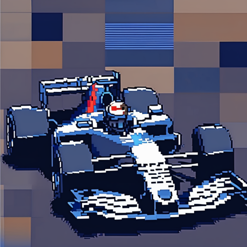

# F1 Minimal API



A minimal API built with **Node.js** and the **Fastify** framework, based on [Felipe Aguiar's boilerplate](https://github.com/felipeAguiarCode/node-blue-boilerplate) for TypeScript projects. This API provides information about Formula 1 teams and drivers.

## Features

- Retrieve a list of Formula 1 teams
- Retrieve a list of Formula 1 drivers
- Retrieve details of a specific driver by ID

## Endpoints

### GET `/teams`
Returns the list of all Formula 1 teams.

**Response:**  
```json
[
  { "id": 1, "name": "Ferrari", "base": "Italy" },
  { "id": 2, "name": "Mercedes", "base": "United Kingdom" }
]
```

### GET `/drivers`
Returns the list of all Formula 1 drivers.

**Response:**  
```json
[
  { "id": 1, "name": "Max Verstappen", "country": "Netherlands" },
  { "id": 2, "name": "Lewis Hamilton", "country": "United Kingdom" }
]
```

### GET `/drivers/:id`
Returns details of a specific driver by ID.

**Request Example:**  
`GET /drivers/1`

**Response:**  
```json
{ "id": 1, "name": "Max Verstappen", "country": "Netherlands" }
```

If the driver is not found, the response is:
```json
null
```

## How to Run Locally

### Prerequisites
- Node.js installed (recommended version: 18+)
- npm or yarn installed

### Steps

1. **Clone the repository:**
   ```bash
   git clone https://github.com/your-username/f1-api.git
   cd f1-api
   ```

2. **Install dependencies:**
   ```bash
   npm install
   # or if using yarn:
   yarn install
   ```

3. **Run the server:**
   ```bash
   node index.js
   ```

4. **Access the server:**  
   The server will be available at `http://localhost:3366`.

## Technologies Used

- **Node.js**: Runtime environment for JavaScript on the server.
- **Fastify**: Fast and low-overhead web framework for Node.js.
- **TypeScript**: Adds static typing to JavaScript (recommended for scaling the project).

## License

This project is licensed under the **ISC License**.

## Acknowledgments

- Built using Felipe Aguiar's TypeScript boilerplate as a foundation.
